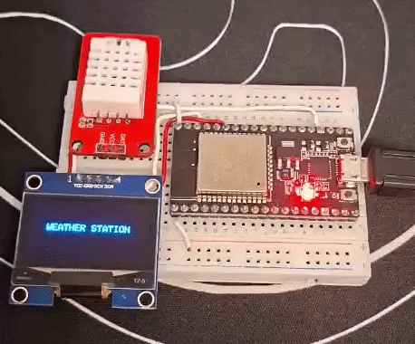

<div align="center">
  
  
  

  <h1>📟 Day 3: ESP32 IoT Weather Station with OLED</h1>
  <p>Displaying high-precision sensor data on a 1.3" SH1106 OLED Display.</p>
</div>

---

## 📝 Project Overview
Today, I upgraded the weather station by integrating a **1.3" OLED Display (SH1106)**. This project focuses on I2C bus management and rendering text/graphics on a pixel-based screen instead of a character-based LCD.

### ✨ Key Features
* **OLED Graphics:** High contrast 128x64 resolution display.
* **I2C Protocol:** Efficient 2-wire communication for both sensor and screen.
* **Compact Design:** Ideal for portable IoT devices.

---

## 📸 Working Demo
<div align="center">
  
  <p><i>The OLED display showing dynamic Temperature and Humidity readings.</i></p>
</div>

---

## 📐 Circuit Connection
| OLED Pin | ESP32 Pin |
| :--- | :--- |
| **VCC** | 3.3V |
| **GND** | GND |
| **SDA** | GPIO 21 |
| **SCL** | GPIO 22 |

*Note: DHT22 remains on GPIO 15.*

---

## 💻 Source Code
<details>
<summary>Click to view code</summary>

```cpp
#include <Wire.h>
#include <Adafruit_GFX.h>
#include <Adafruit_SH110X.h>
#include "DHT22.h"

#define i2c_Address 0x3c
#define SCREEN_WIDTH 128
#define SCREEN_HEIGHT 64
#define OLED_RESET -1

Adafruit_SH1106G display = Adafruit_SH1106G(SCREEN_WIDTH, SCREEN_HEIGHT, &Wire, OLED_RESET);
DHT22 dht22(15);

void setup() {
  Serial.begin(115200);

  if(!display.begin(i2c_Address, true)) {
    Serial.println(F("SH1106 not found!"));
    for(;;);
  }

  display.clearDisplay();
  display.setTextSize(1);
  display.setTextColor(SH110X_WHITE);
  display.setCursor(20, 25);
  display.println("WEATHER STATION");
  display.display();
  delay(2000);
}

void loop() {
  delay(2000);

  float t = dht22.getTemperature();
  float h = dht22.getHumidity();

  display.clearDisplay();

  if (dht22.getLastError() != dht22.OK) {
    display.setCursor(0, 0);
    display.println("Sensor Error!");
  } else {

    display.setTextSize(1);
    display.setCursor(20, 0);
    display.println("--- DAY 03 ---");
    display.drawLine(0, 10, 128, 10, SH110X_WHITE);


    display.setTextSize(2);
    display.setCursor(0, 20);
    display.print("T: ");
    display.print(t, 1);
    display.print(" C");

    display.setCursor(0, 45);
    display.print("H: %");
    display.print(h, 1);
  }

  display.display();
}