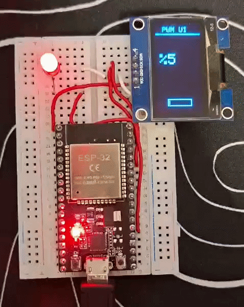

# 💡 Day 05 OLED LED Dimmer

An advanced brightness control system that utilizes ESP32's updated PWM (LEDC) architecture to smoothly fade an LED while displaying the real-time brightness percentage on an SH1106 OLED display in portrait layout.

## 🛠️ Project Features
- Modern PWM Architecture Uses the updated ESP32 Core v3.0+ `ledcAttach` syntax for glitch-free hardware PWM control.
- Portrait UI Gauge A vertical layout that displays a live percentage indicator (`%0` to `%100`).
- Dynamic Progress Bar A visual horizontal bar on the screen that fills up in perfect sync with the LED's real-time brightness.
- Breathing Effect Automated software logic that infinitely fades the LED in and out smoothly.

## 📐 Circuit Configuration

 Component  Pin  ESP32 Pin  Description 
 ---  ---  ---  --- 
 LED  Anode (+)  GPIO 4 (or 2)  PWM Output (Use a resistor) 
 LED  Cathode (-)  GND  Ground 
 SH1106 OLED  VCC  3.3V  Display Power 
 SH1106 OLED  GND  GND  Ground 
 SH1106 OLED  SDA  GPIO 21  I2C Data Line 
 SH1106 OLED  SCL  GPIO 22  I2C Clock Line 

## 📸 Working Demo
<div align="center">
  
  <p><i>The OLED display showing dynamic Temperature and Humidity readings.</i></p>
</div>

## 💻 Source Code
<details>
<summary>Click to view code</summary>

```cpp
#include <Wire.h>
#include <Adafruit_GFX.h>
#include <Adafruit_SH110X.h>

#define i2c_Address 0x3c
Adafruit_SH1106G display = Adafruit_SH1106G(128, 64, &Wire, -1);

const int ledPin = 2;
const int pwmChannel = 0;
const int freq = 5000;
const int resolution = 8;

int brightness = 0;
bool fadingIn = true;

void setup() {
  ledcSetup(pwmChannel, freq, resolution);
  ledcAttachPin(ledPin, pwmChannel);

  display.begin(i2c_Address, true);
  display.setRotation(1);
  display.clearDisplay();
}

void loop() {
  ledcWrite(pwmChannel, brightness);

  int percent = map(brightness, 0, 255, 0, 100);

  display.clearDisplay();
  display.setTextSize(1);
  display.setTextColor(SH110X_WHITE);
  display.setCursor(10, 5);
  display.println("PWM UI");
  display.drawLine(0, 15, 64, 15, SH110X_WHITE);

  display.setTextSize(2);
  display.setCursor(5, 45);
  display.print("%");
  display.print(percent);

  int barHeight = map(percent, 0, 100, 0, 50);
  display.drawRect(15, 110, 34, 10, SH110X_WHITE); 
  display.fillRect(17, 112, barHeight * 0.6, 6, SH110X_WHITE);

  display.display();

  if (fadingIn) {
    brightness += 5;
    if (brightness >= 255) fadingIn = false;
  } else {
    brightness -= 5;
    if (brightness <= 0) fadingIn = true;
  }

  delay(30);
}

## 🚀 How to Run
1. Open the Arduino IDE and install `Adafruit_GFX` and `Adafruit_SH110X` libraries via the Library Manager.
2. Wire up your hardware components according to the Circuit Configuration matrix above.
3. Double-check your code to ensure the `ledPin` variable matches your chosen hardware pin (e.g., `const int ledPin = 4;`).
4. Select your ESP32 board and the correct COM port in the IDE.
5. Click Upload to flash the code onto your micro-controller.