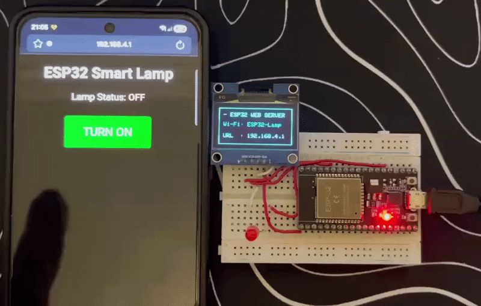

# 🌐 Day 06: Wi-Fi Web Server LED

An interactive local IoT project that configures the ESP32 as an Access Point (SoftAP) to host a wireless web server. This allows users to control a physical LED via a mobile browser while displaying the network credentials live on an SH1106 OLED display.

## 🛠️ Project Features
- **SoftAP (Access Point) Mode:** Stands up its own private Wi-Fi network without requiring an external internet router.
- **Local Web Server (Port 80):** Serves a lightweight HTML/CSS control page with responsive web components to any connected client.
- **Synchronized Status Logic:** Tracks the true state of the GPIO pin and renders dynamic UI elements depending on whether the lamp is ON or OFF.
- **Horizontal Dashboard:** Clean landscape layout utilizing custom borders to clearly display connection instructions.

## 📐 Circuit Configuration

| Component | Pin | ESP32 Pin | Description |
| :--- | :--- | :--- | :--- |
| **LED** | Anode (+) | GPIO 2 | Digital Output (Controlled via Web UI) |
| **LED** | Cathode (-) | GND | Ground |
| **SH1106 OLED** | VCC | 3.3V | Display Power |
| **SH1106 OLED** | GND | GND | Ground |
| **SH1106 OLED** | SDA | GPIO 21 | I2C Data Line |
| **SH1106 OLED** | SCL | GPIO 22 | I2C Clock Line |

## 📸 Working Demo
<div align="center">
  
  <p><i>The OLED display showing dynamic Temperature and Humidity readings.</i></p>
</div>

## 💻 Source Code
<details>
<summary>Click to view code</summary>

```cpp
#include <WiFi.h>
#include <Wire.h>
#include <Adafruit_GFX.h>
#include <Adafruit_SH110X.h>

#define i2c_Address 0x3c
#define SCREEN_WIDTH 128
#define SCREEN_HEIGHT 64
Adafruit_SH1106G display = Adafruit_SH1106G(SCREEN_WIDTH, SCREEN_HEIGHT, &Wire, -1);

// Wi-Fi Network Settings
const char* ssid = "ESP32-Lamp";
const char* password = "123456789Password";

WiFiServer server(80);
const int ledPin = 2; // Your LED pin

void setup() {
  Serial.begin(115200);
  pinMode(ledPin, OUTPUT);
  digitalWrite(ledPin, LOW);

  // OLED Setup (Flipped Horizontal Mode)
  display.begin(i2c_Address, true);
  display.setRotation(2); // <--- Kept your preferred flipped layout
  display.clearDisplay();
  
  display.setTextSize(1);
  display.setTextColor(SH110X_WHITE);
  display.setCursor(0, 0);
  display.println("Initializing Wi-Fi...");
  display.display();

  // Start Access Point
  WiFi.softAP(ssid, password);
  IPAddress IP = WiFi.softAPIP();
  server.begin();

  // OLED Dashboard UI (English Layout)
  display.clearDisplay();
  display.drawRect(0, 0, 128, 64, SH110X_WHITE); // Outer sleek frame
  
  display.setCursor(8, 8);
  display.setTextSize(1);
  display.println("- ESP32 WEB SERVER");
  
  display.setCursor(8, 25);
  display.print("Wi-Fi: ");
  display.println(ssid);

  display.setCursor(8, 45);
  display.print("URL  : ");
  display.println(IP.toString()); 
  display.display();
}

void loop() {
  WiFiClient client = server.available(); 

  if (client) {                             
    String currentLine = "";                
    while (client.connected()) {            
      if (client.available()) {             
        char c = client.read();             
        
        // Parse the incoming HTTP request line by line
        if (c == '\n') {                    
          if (currentLine.length() == 0) {
            // Send standard HTTP response headers
            client.println("HTTP/1.1 200 OK");
            client.println("Content-type:text/html");
            client.println("Connection: close"); 
            client.println();

            // HTML Web Page Source
            client.println("<!DOCTYPE html><html>");
            client.println("<head><meta name=\"viewport\" content=\"width=device-width, initial-scale=1\">");
            client.println("<style>html { font-family: Arial; display: inline-block; margin: 0px auto; text-align: center;}");
            client.println(".button { background-color: #4CAF50; border: none; color: white; padding: 20px 40px;");
            client.println("text-decoration: none; font-size: 25px; margin: 10px; cursor: pointer; border-radius: 5px;}");
            client.println(".button2 {background-color: #f44336;}</style></head>");
            
            client.println("<body><h1>ESP32 Smart Lamp</h1>");
            
            // Dynamic Button rendering based on the physical state of the LED
            if (digitalRead(ledPin) == HIGH) {
              client.println("<p style='font-size:20px;'>Lamp Status: <b style='color:green;'>ON</b></p>");
              client.println("<p><a href=\"/L\"><button class=\"button button2\">TURN OFF</button></a></p>");
            } else {
              client.println("<p style='font-size:20px;'>Lamp Status: <b style='color:red;'>OFF</b></p>");
              client.println("<p><a href=\"/H\"><button class=\"button\">TURN ON</button></a></p>");
            }
            client.println("</body></html>");
            break;
          } else {
            // Check incoming URI routes
            if (currentLine.indexOf("GET /H") >= 0) {
              digitalWrite(ledPin, HIGH); // Turn LED ON
            }
            if (currentLine.indexOf("GET /L") >= 0) {
              digitalWrite(ledPin, LOW);  // Turn LED OFF
            }
            currentLine = "";
          }
        } else if (c != '\r') {
          currentLine += c;
        }
      }
    }
    delay(1); 
    client.stop(); // Close connection
  }
}

## 🚀 How to Run
1. Launch Arduino IDE and ensure the native `WiFi.h` core library is available along with your OLED drivers.
2. Build the circuit matrix aligning your signal lines perfectly with the designated pins.
3. Flash the code onto your ESP32 microcontroller.
4. Scan for local wireless networks, input your secure credentials, and visit the webpage dashboard to control your hardware wirelessly.