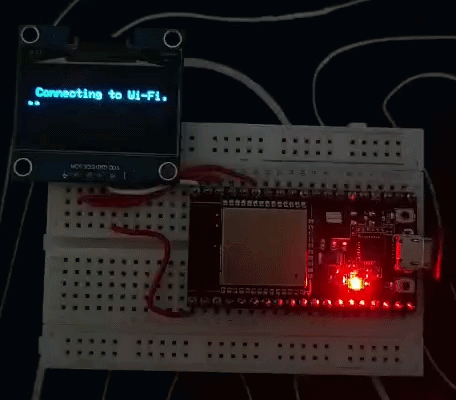

# ⏰ Day 07: Internet Clock (NTP)

A highly accurate, synchronized network digital clock application that connects the ESP32 to a local Wi-Fi network and utilizes the native ESP32 core architecture to fetch absolute real-time atomic data from global NTP servers.

---

## 🛠️ Project Features
- **Native NTP Integration:** Eliminates external libraries by leveraging the built-in ESP32 `time.h` framework for robust and pürüzsüz synchronization.
- **Atomic Clock Precision:** Connects to `pool.ntp.org` via UDP packets to query live timezone telemetry.
- **Automatic Time Formatting:** Utilizes memory-safe `strftime` buffers to seamlessly separate and align hours, minutes, seconds, and dates.
- **Outlier Mitigation Loop:** Features a validation guard (`getLocalTime`) that locks out memory-drift artifacts, ensuring the calendar never displays corrupted or futuristic placeholder dates.

---

## 📐 Circuit Configuration

| Component | Pin | ESP32 Pin | Description |
| :--- | :--- | :--- | :--- |
| **SH1106 OLED** | VCC | 3.3V | Display Power Supply |
| **SH1106 OLED** | GND | GND | Ground |
| **SH1106 OLED** | SDA | GPIO 21 | I2C Data Line |
| **SH1106 OLED** | SCL | GPIO 22 | I2C Clock Line |

---

## 📸 Working Demo
<div align="center">
  
</div>

---

## 🚀 How to Run
1. Open the code in your Arduino IDE. 
2. Fill in your network credentials by replacing the `ssid` and `password` placeholders with your own home Wi-Fi details:
   ```cpp
   const char* ssid     = "YOUR_WIFI_SSID";
   const char* password = "YOUR_WIFI_PASSWORD";